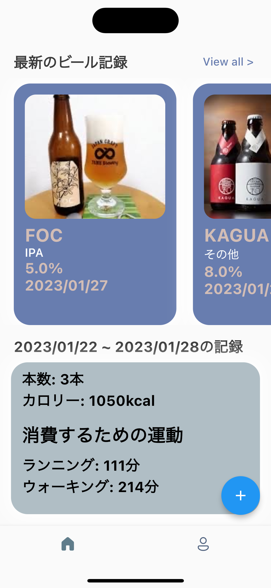
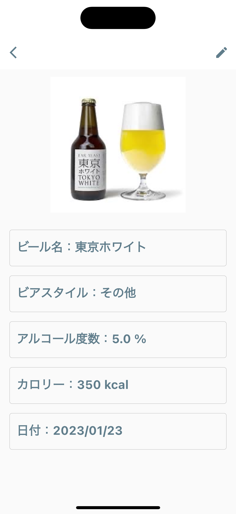
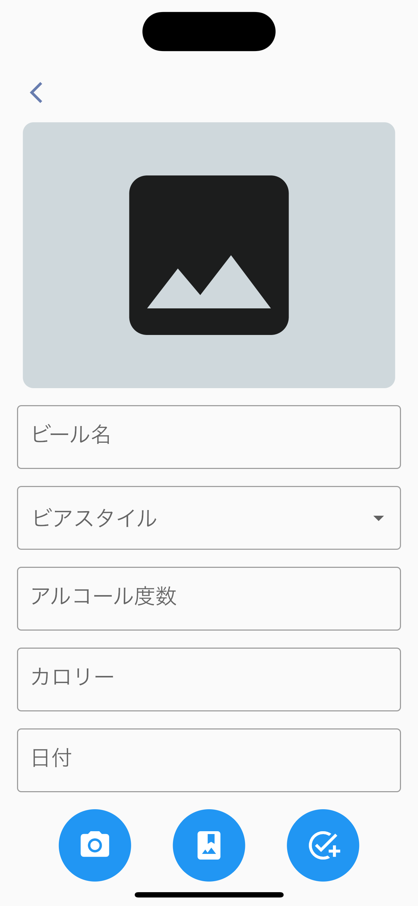
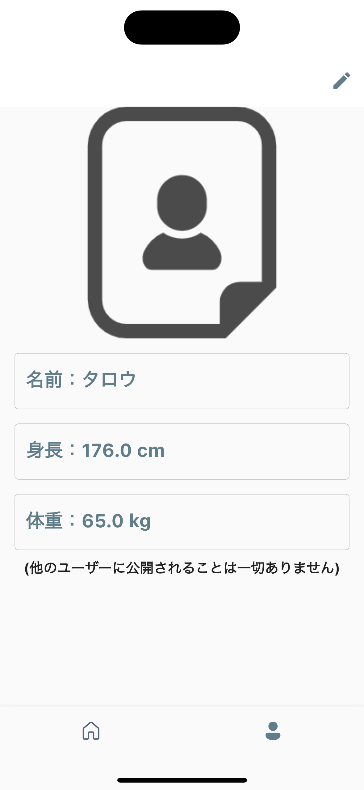

# beer collection app

## 概要

- ビールを記録するためのアプリ
- ビール記録の際にカロリーを入力すると、そのカロリーを消費するために必要な運動時間が表示される

## 詳細情報

|                                画面                                | 説明                                                                                                                                                                                                                                                                                                                         |
| :----------------------------------------------------------------: | :--------------------------------------------------------------------------------------------------------------------------------------------------------------------------------------------------------------------------------------------------------------------------------------------------------------------------- |
|      | **ホーム画面**<br><br> • 画面上部には最新のビール記録が表示されます。<br>ビール記録は登録日が新しい順に表示されます<br> • 画面下部には当日を含む１週間のビールの記録から算出された本数、カロリー、そのカロリーを消費するための運動時間が表示されます。予め、プロフィール画面よりユーザーの身長と体重を登録する必要があります |
|    | **ビール記録詳細画面**<br><br> • ビールを記録する際に入力した情報が表示されます。表示内容はビール名、ビアスタイル、アルコール度数、カロリー、日付、画像です。編集も可能です。                                                                                                                                                |
|  | **ビール記録登録画面**<br><br> • ビールを記録するための画面。ビール名、ビアスタイル、アルコール度数、カロリー、日付、画像をを入力します。画像はライブラリから選択するか、カメラで撮影したものを使用することができます。                                                                                                      |
|   | **プロフィール画面**<br><br> • ユーザーの名前、身長、体重が表示されます。ホーム画面に表示される運動時間の計算に用いられます。                                                                                                                                                                                                |

## ファイル構成

プロジェクト作成時にできたファイル構成をそのまま使用。lib 配下に実装コードを記載している。
また、 pubspec.yaml に必要なライブラリを記載し使用している。ファイル構成は以下に示す通りである。

```bash
.
├── README.md              # このリポジトリの説明ファイル
├── analysis_options.yaml  # 静的解析のルールを記載したファイル
├── android                # Androidに関する設定やソースが格納されている
├── assets                 # 画像ファイルが格納されている
├── build                  # ビルド成果物が格納されている
├── ios                    # iOSに関する設定やソースが格納されている
├── lib                    # プロダクトコードを管理するフォルダ
│   ├── entities           # エンティティのクラスが格納されている
│   ├── l10n               # 多言語対応用のファイルが格納されている
│   ├── main.dart          # アプリを実行した時に最初に呼ばれる関数が記載されたファイル
│   ├── repository         # データの永続化のための処理が格納されている
│   ├── util               # 汎用メソッドが格納されている
│   ├── view               # ページレベルのウィジェットが格納されている。ディレクトリ構成 = パス階層 になるようにディレクトリを切っている
│   └── widgets            # 汎用ウィジェットが格納されている
├── pubspec.lock           # pubspec.yamlファイルで設定したパッケージのバージョンが特定されているファイル
├── pubspec.yaml           # 外部のライブラリ（パッケージ）情報が記載されたファイル
└── test
    ├── unit               # ユニットテストが格納されている
    └── widget_test.dart   # ウィジェットテストが格納されている
```

## 各種コマンド

### 実行

ビルドからインストール、実行まで全て実施してくれる。

```bash
 ❯❯❯ flutter run
```

### テスト

プロジェクト直下の test ディレクトリのユニットテストを実行する。

```bash
 ❯❯❯ flutter test
```

### 実機インストール方法

以下の手順を踏む

1.  iPhone をつなぎ認識されていることを確認する。またここでデバイスの ID を確認する

```bash
 ❯❯❯ flutter devices
```

2.  一旦ビルドで作成されたファイルを削除する

```bash
 ❯❯❯ flutter clean
```

3. ビルドを実施する

```bash
 ❯❯❯ flutter build ios # iOS版をビルドする

 ❯❯❯ flutter build apk # Android版をビルドする
```

4. 実機 iPhone にインストールする。[デバイス ID]には手順１で表示されている ID を入力する

```bash
 ❯❯❯ flutter install -d [デバイスID]
```
